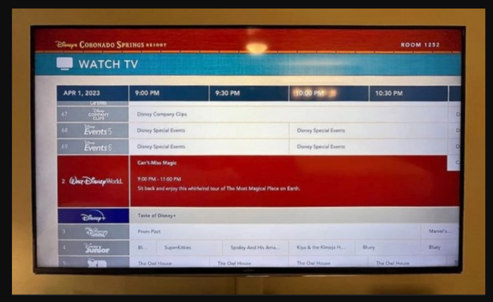
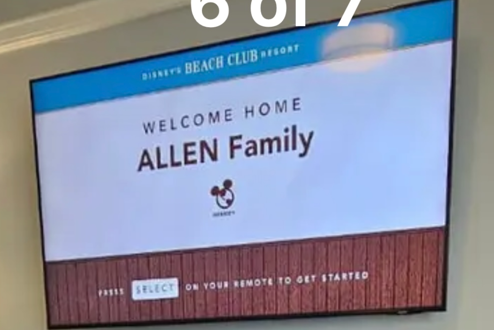
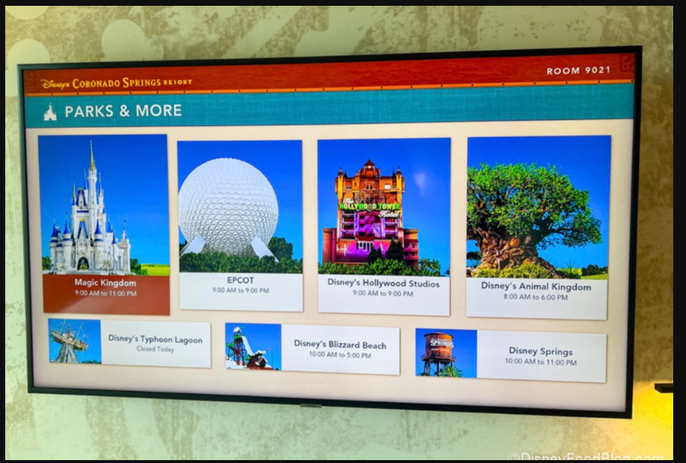
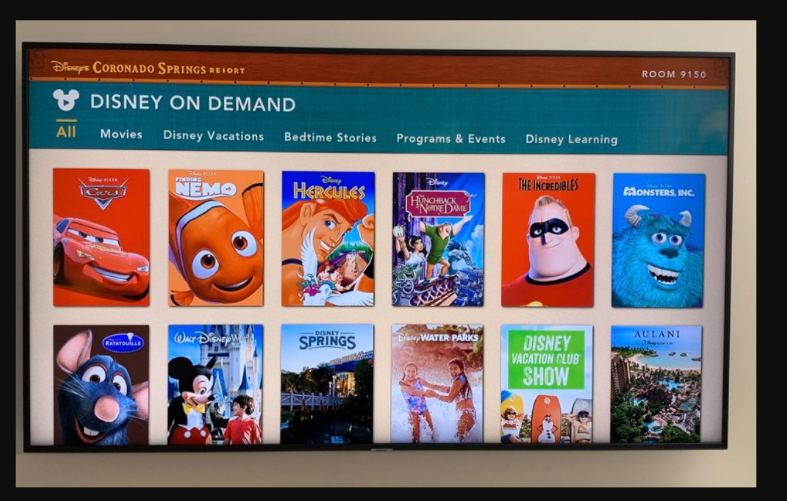
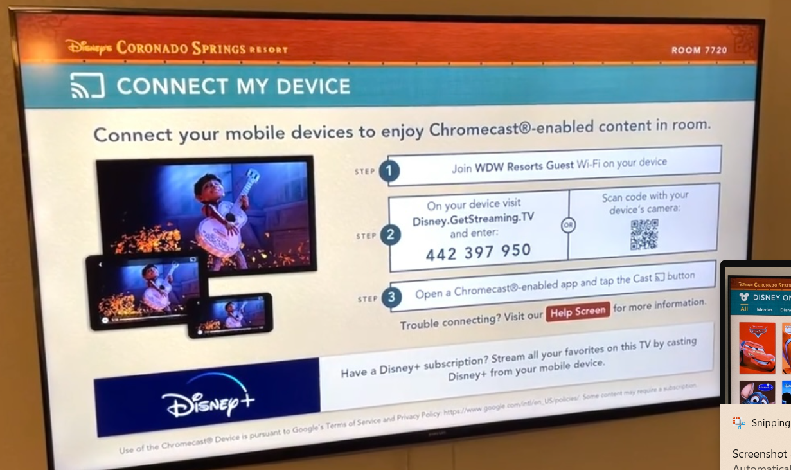
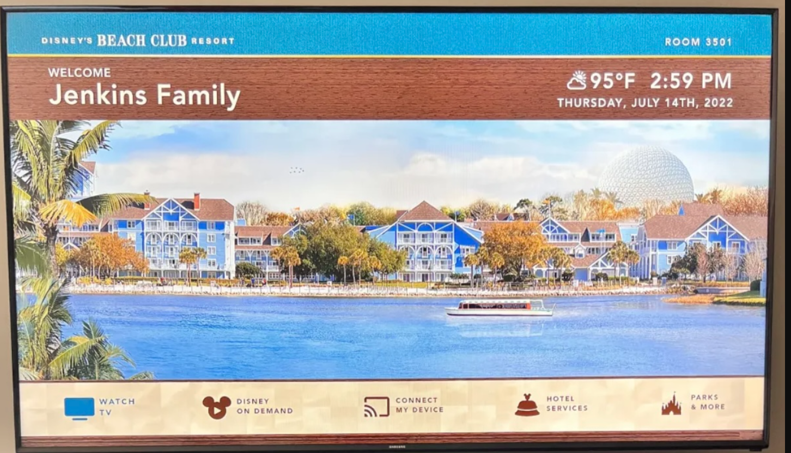
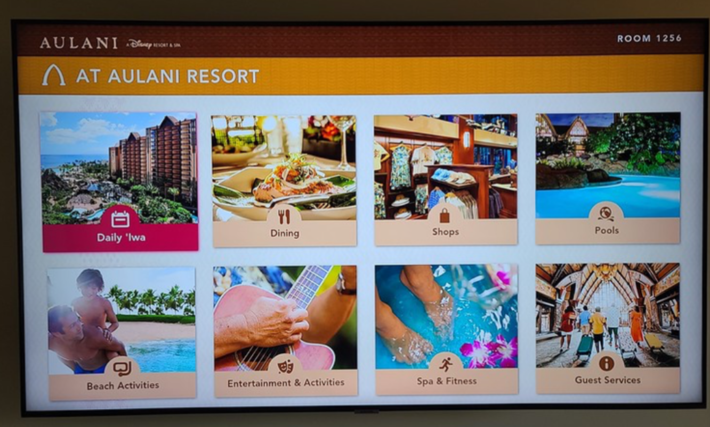
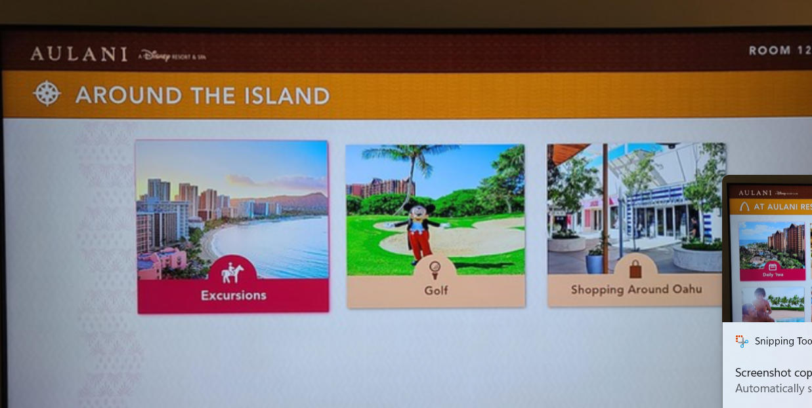

# Upwork Contract Reference

## Job description

> I have a custom personal project. I want to recreate the look and feel of the Disney resort TV welcome screen as a 1920×1080 HTML/CSS/JavaScript webpage for use on a TV in my home. I have screenshots and a background video for reference. The header/footer, clock, weather, and menu should be built in HTML/CSS. The background should play continuously and stay synchronized with the current time of day.

## Video reference

[Disney Resort TV reference video](https://youtu.be/_kg4kl9jhsM?si=gNDE9wL196G_DP5)

## Upwork attachments

### 1. Watch TV guide

### 2. Welcome loader

### 3. Parks & More

### 4. Disney On Demand

### 5. Connect My Device

### 6. Main welcome menu

### 7. Aulani resort menu

### 8. Around the Island

